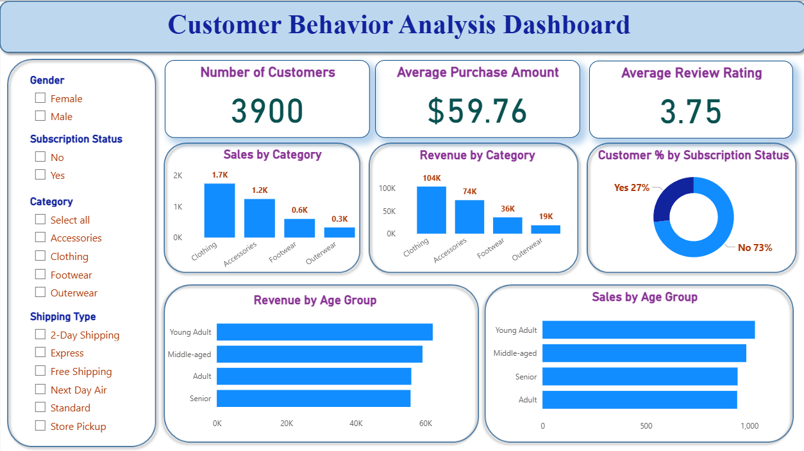

# Customer Behavior Analysis

## Overview

The **Customer Behavior Analysis** dashboard provides insights into customer purchasing behavior. This analysis includes various metrics like revenue by gender, average spending, product ratings, and customer segmentation. By examining customer behavior patterns, businesses can optimize sales strategies and improve customer satisfaction.

The repository contains SQL queries to analyze customer shopping behavior stored in a database named `customer_behav`, with relevant visualizations displayed in the dashboard.

## Dashboard Overview

### Key Metrics:

* **Total Number of Customers**: 3,900
* **Average Purchase Amount**: $59.76
* **Average Review Rating**: 3.75
* **Customer Subscription Status**: 27% of customers are subscribed, while 73% are not.
* **Sales by Category**: Sales data for clothing, accessories, footwear, and outerwear.
* **Revenue by Category**: Revenue distribution across different product categories.
* **Sales by Age Group**: Breakdown of sales by age group.

  

### SQL Queries

The SQL queries provided in this repository analyze customer behavior in the following areas:

1. **Total revenue by gender**: Computes the total revenue generated by male and female customers.
2. **Discount users who spent more than the average amount**: Identifies customers who applied a discount and spent more than the average amount.
3. **Top 5 highest-rated products**: Retrieves the top 5 products with the highest average review ratings.
4. **Average spending by shipping type**: Analyzes average purchase amounts based on different shipping types.
5. **Do subscribed customers spend more?**: Compares spending between subscribed and non-subscribed customers.
6. **Top 5 products with the highest discount usage rate**: Identifies the top 5 products with the highest discount usage.
7. **Segment customers (New, Returning, Loyal)**: Categorizes customers based on their purchase history (new, returning, or loyal).
8. **Top 3 most purchased products in each category**: Finds the top 3 most purchased items in each product category.
9. **Repeat buyers and subscription status**: Analyzes repeat buyers and their subscription status.
10. **Revenue contribution by age group**: Computes total revenue generated by different age groups.

## Database Schema

The following table structure is assumed in the database:

### `customer_shopping_behavior` Table:

* `Customer ID`: Unique identifier for each customer.
* `Gender`: Gender of the customer.
* `Subscription Status`: Whether the customer is subscribed or not.
* `Age`: Age of the customer.
* `Purchase Amount (USD)`: Amount spent by the customer.
* `Item Purchased`: Item bought by the customer.
* `Review Rating`: Rating given by the customer for the product.
* `Discount Applied`: Whether a discount was applied to the purchase.
* `Shipping Type`: Type of shipping selected (e.g., Standard, Express, etc.).
* `Previous Purchases`: The number of previous purchases made by the customer.
* `Category`: The category of the purchased item (e.g., Clothing, Accessories).

## Installation

1. Clone this repository to your local machine.

   ```bash
   git clone https://github.com/yourusername/customer-behavior-analysis.git
   ```

2. Import the `customer_behav` database and the `customer_shopping_behavior` table to your preferred database system (e.g., MySQL, PostgreSQL).

3. Execute the SQL queries in the repository to analyze customer behavior.

